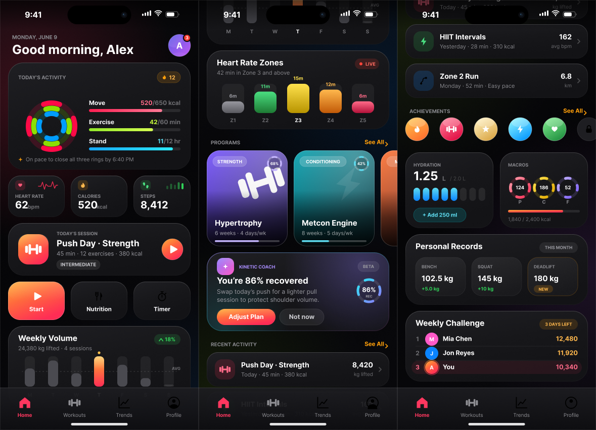

# Alcedo

<p align="center">
  
</p>

---

## 🚀 Overview

**Alcedo** is an intuitive, cross-platform gym weight tracking app built with React Native and Expo. It features AI-powered workout planning, rich training analytics, and secure, end-to-end encrypted social feeds. Available on Android and iOS.

### Key Features

- 🗿 Intuitive UI which lets you log your progression, without getting in your way
- Entirely device local workouts, no waiting for sign in or downloads
- 📱 Runs on Android and iOS
- 🔒 End-to-end encrypted social feeds (opt-in, privacy-first)
- 🌐 Internationalization with Tolgee
- 🏋️‍♂️ Publish workouts, follow other users, and control your feed privacy
- 🧠 AI planner tailors gym plans to your goals and body
- ⚡ Fast, modern UI with Expo Router and Redux Toolkit

---

## ⚡ Quickstart

### Prerequisites

1. **Node.js** (v18+): [Download here](https://nodejs.org/)
2. **Expo CLI**: `npm install -g expo-cli` ([Guide](https://docs.expo.dev/get-started/set-up-your-environment/))
3. **Android Studio** (for Android) ([Setup](https://reactnative.dev/docs/environment-setup))
4. **Xcode** (for iOS, macOS only) ([Setup](https://reactnative.dev/docs/environment-setup?os=macos&platform=ios))

### Run the App

```bash
cd app
npm install
npm run android   # For Android
npm run ios       # For iOS (macOS only)
```

### Run the Backend API

See [`backend/README.md`](./backend/README.md) for more information on running the backend.

---

## 🗂️ Project Structure

Alcedo is organized into several projects:

### Frontend ([app/](./app/))

- **Main React Native app** (Expo)
- **Components**: `components/` (layout, presentation, smart)
- **State**: `store/` (Redux Toolkit)
- **Services**: `services/` (API, business logic)
- **Hooks**: `hooks/` (custom React hooks)
- **Translations**: `i18n/` (Tolgee)
- **Navigation**: Expo Router

### Backend ([backend/](./backend/))

For documentation on running the backend for local development, see [the README](./backend/README.md)

- **Dotnet WebAPI** for feeds, AI plans, and backups
- **End-to-end encrypted feeds** (AES)
- **Claude integration** for workout plans

### RevenueCat ([RevenueCat/](./backend/RevenueCat/))

- **Client library** for in-app purchases/subscriptions

---

## 📊 Stats

<a href="https://www.star-history.com/?type=date&repos=Luke23-45%2Falcedo">
 <picture>
   <source media="(prefers-color-scheme: dark)" srcset="https://api.star-history.com/chart?repos=Luke23-45/alcedo&type=date&theme=dark&legend=top-left" />
   <source media="(prefers-color-scheme: light)" srcset="https://api.star-history.com/chart?repos=Luke23-45/alcedo&type=date&legend=top-left" />
   
 </picture>
</a>

---

## 🤝 Contributing

Contributions, issues, and feature requests are welcome! See [CONTRIBUTING.md](./CONTRIBUTING.md) (or open an issue/PR).

AI/LLM-assisted contributions are welcome, but issues and feature requests should be written in your own words - see the [AI Usage Policy](./CONTRIBUTING.md#ai-usage-policy).

## 📚 Documentation

- [Self Hosting](./docs/SelfHosting.md) - Documents the how to self host the backend for backups or your own AI planner and private feed.
- [Plan Files](./docs/PlanFileFormat.md) - Documents the `.liftlogplan` file format, and how to generate plans with an AI for import into the app.
- [Feed Process](./docs/FeedProcess.md) - Documents how the feed and sharing works, especially around e2e encryption.
- [Remote Backup](./docs/RemoteBackup.md) - Documents how to connect Alcedo to a remote backup server.
- [Plaintext Export](./docs/PlaintextExport.md) - Documents how to export your data as plaintext.
- [Workout Worker](./docs/WorkoutWorker.md) - Documents the WorkoutWorker, an event based bridge between native and JS which powers the Android persistent notifications.
- [Storage Migrations](./docs/Migrations.md) - Documents how on-device data is versioned and migrated, and what to do when changing a stored model.
